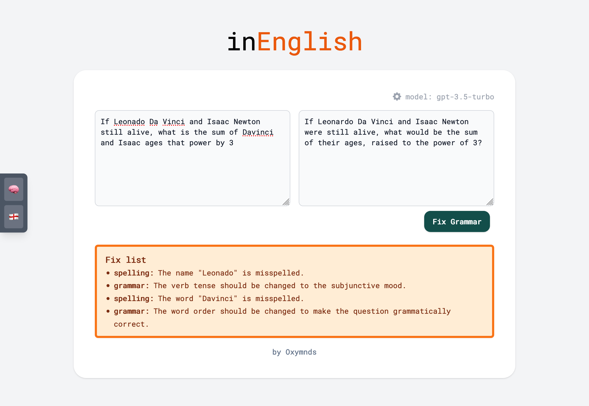

# 🤔 InMind

InMind is a web application designed to show how LLMs like ChatGPT can find answers by reflecting on information and using the provided tools to arrive at the final answer.

## Features

### Question Answering


### English grammar fixer



## Project setup
```
npm install -g pnpm@8.0.0

pnpm install
```

### Compiles and hot-reloads for development
```
pnpm run serve
```

### Compiles and minifies for production
```
pnpm run build
```

### Lints and fixes files
```
pnpm run lint
```

### Customize configuration
See [Configuration Reference](https://cli.vuejs.org/config/).
